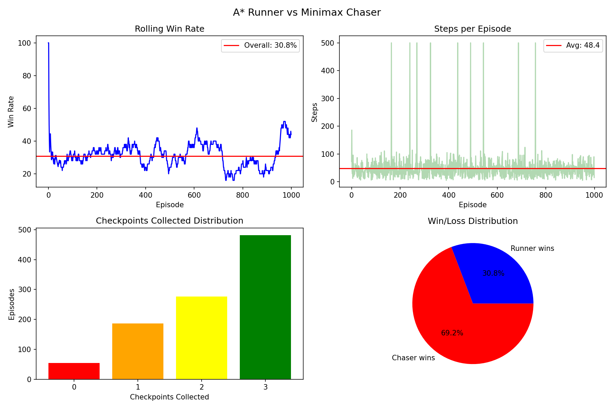
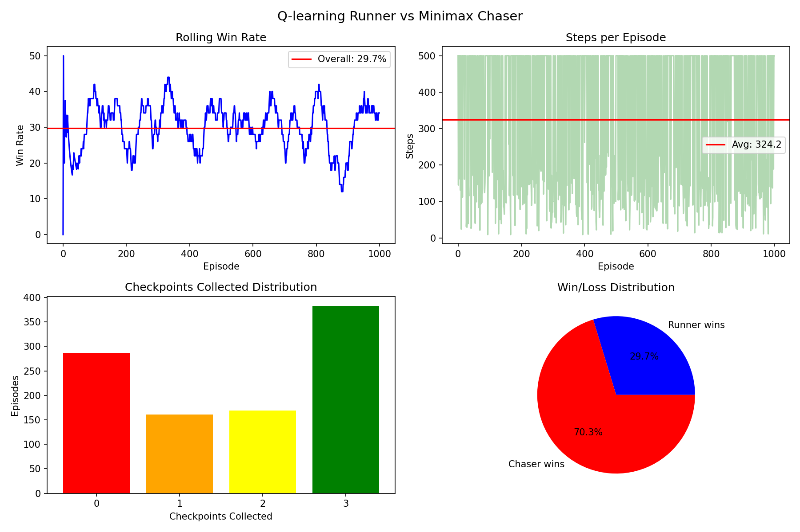
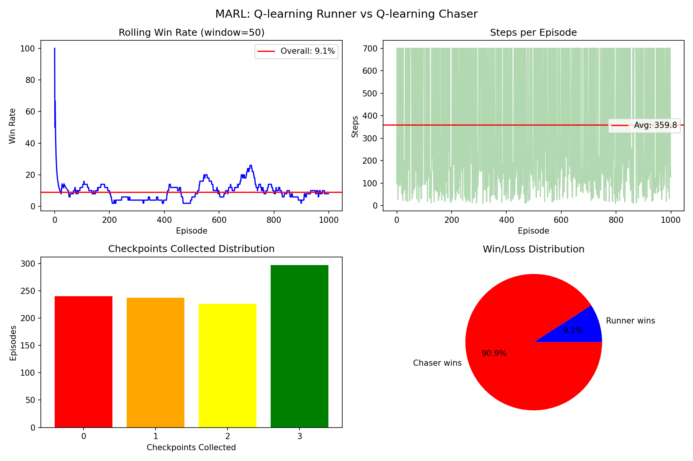

# MazeRunner: Adversarial Maze Navigation Using Classical Search and Reinforcement Learning

A two-agent adversarial maze game comparing classical AI search algorithms against reinforcement learning strategies. Built as the final project for **CS 5100: Foundations of Artificial Intelligence** at Northeastern University.

**Authors:** Shalavya Agrawal & Param Jain

---

## Overview

MazeRunner pits a **Runner** agent against a **Chaser** agent on a randomly generated grid-based maze. The Runner must collect three checkpoints scattered across the maze and reach the exit before the Chaser catches it. Both agents move simultaneously each turn, creating a dynamic adversarial planning problem.

We implement and compare three strategy matchups:

| Matchup | Runner Strategy | Chaser Strategy | Win Rate | Avg Steps |
|---------|----------------|-----------------|----------|-----------|
| Classical vs Classical | A* with danger-zone awareness | Minimax with alpha-beta pruning | **30.8%** | 48.4 |
| RL vs Classical | Q-Learning (100K episodes) | Minimax with alpha-beta pruning | 29.7% | 324.2 |
| RL vs RL (MARL) | Q-Learning (co-trained) | Q-Learning (co-trained) | 9.1% | 359.8 |

> Results from 1,000 evaluation episodes on a 21×21 grid.

---

## Game Rules

- Played on an N×N grid maze generated via randomized Prim's algorithm with loop-opening
- **Runner** collects 3 checkpoints (placed in separate quadrants) then reaches the exit to win
- **Chaser** wins by occupying the same cell as the Runner
- Both agents move simultaneously (up/down/left/right)
- Game ends on Runner win, Chaser catch, or step limit (500 for A*/Q-Learning, 700 for MARL)

---

## Project Structure

```
MazeRunner/
├── maze_env.py              # Maze generation (Prim's algorithm), game state, entity placement
├── renderer.py              # Step-by-step gameplay visualization
├── agents/
│   ├── astar.py             # A* search + enhanced A* with chaser danger-zone avoidance
│   ├── minimax.py           # Minimax chaser with alpha-beta pruning (depth=2)
│   ├── q_agent.py           # Single-agent Q-learning runner (training + inference)
│   └── marl.py              # Multi-agent RL: independent Q-learning for both runner & chaser
├── main_minimax.py          # Run A* Runner vs Minimax Chaser gameplay
├── main_qlearning.py        # Run Q-Learning Runner vs Minimax Chaser gameplay
├── main_marl.py             # Run MARL gameplay
├── q_tables/
│   ├── q_table.pkl          # Pre-trained Q-table for single-agent runner
│   ├── runner_marl.pkl      # Pre-trained MARL runner Q-table
│   └── chaser_marl.pkl      # Pre-trained MARL chaser Q-table
└── tests/
    ├── test_minimax.py      # Benchmark: A* Runner vs Minimax Chaser (1000 episodes)
    ├── test_qlearning.py    # Benchmark: Q-Learning Runner vs Minimax Chaser (1000 episodes)
    ├── test_marl.py         # Benchmark: MARL evaluation (1000 episodes)
    ├── results_minimax.png  # Results chart for A* vs Minimax
    ├── results_q.png        # Results chart for Q-Learning vs Minimax
    └── results_marl.png     # Results chart for MARL
```

---

## Setup

### Requirements

- Python 3.10+
- NumPy
- Matplotlib (for benchmark visualization)

### Installation

```bash
git clone https://github.com/Shalavya8103/MazeRunner.git
cd MazeRunner
pip install numpy matplotlib
```

---

## Usage

### Play / Visualize Games

```bash
# A* Runner vs Minimax Chaser
python main_minimax.py

# Q-Learning Runner vs Minimax Chaser
python main_qlearning.py

# MARL: Q-Learning Runner vs Q-Learning Chaser
python main_marl.py
```

### Run Benchmarks (1,000 episodes each)

```bash
cd tests

# A* Runner vs Minimax Chaser
python test_minimax.py

# Q-Learning Runner vs Minimax Chaser
python test_qlearning.py

# MARL evaluation
python test_marl.py
```

Each test script outputs win rate, average steps, timeout count, and average checkpoints collected, and saves a 4-panel results chart to the `tests/` directory.

### Train Q-Learning Agents from Scratch

```bash
# Train single-agent Q-learning runner (100,000 episodes, ~30 min)
python agents/q_agent.py

# Train MARL runner + chaser (100,000 episodes, ~45 min)
python agents/marl.py
```

Pre-trained Q-tables are included in `q_tables/` so you can skip training and go straight to evaluation.

---

## Algorithms

### A* with Danger-Zone Awareness (`agents/astar.py`)

Enhanced A* that adds a proximity penalty when candidate cells are near the Chaser. The Runner selects its next checkpoint target by combining Manhattan distance with a chaser-proximity penalty, then navigates using the modified cost function. This lets it dynamically reroute around the Chaser while still making progress.

### Minimax Chaser (`agents/minimax.py`)

Adversarial search with alpha-beta pruning at depth 2. The evaluation function rewards Chaser proximity to the Runner and penalizes Runner progress toward its next target. A move history prevents oscillation.

### Q-Learning Runner (`agents/q_agent.py`)

Tabular Q-learning trained over 100,000 episodes against the Minimax Chaser. Key hyperparameters:

- Learning rate (α): 0.1
- Discount factor (γ): 0.95
- Epsilon decay: 0.99995 (from 1.0 → 0.05)
- Rewards: +500 win, +100 checkpoint, −300 caught, −2/step, −5 revisit, ±1 distance shaping

### Multi-Agent RL (`agents/marl.py`)

Both Runner and Chaser train as independent Q-learning agents over 100,000 co-training episodes with separate Q-tables and epsilon schedules. The Chaser receives +500 for catching, −500 for Runner escape, and distance-based shaping rewards.

---

## Key Results

<p align="center">
  
  <br><em>Figure 1: A* Runner vs Minimax Chaser — 30.8% win rate, 48.4 avg steps</em>
</p>

<p align="center">
  
  <br><em>Figure 2: Q-Learning Runner vs Minimax Chaser — 29.7% win rate, 324.2 avg steps</em>
</p>

<p align="center">
  
  <br><em>Figure 3: MARL (Q-Learning vs Q-Learning) — 9.1% runner win rate, 359.8 avg steps</em>
</p>

### Takeaways

- **A\* is the most efficient Runner strategy** — highest win rate with 7× fewer steps than Q-Learning
- **Q-Learning matches A\* in win rate** but suffers from high timeouts (~56%) due to state space coverage gaps
- **The Q-Learning Chaser is far more effective than Minimax** — catches the Runner in 90%+ of MARL games
- **Larger mazes favor the Runner** — A* win rate increases from 23.7% (15×15) to 46.0% (31×31)

---

## References

1. R. S. Sutton and A. G. Barto, *Reinforcement Learning: An Introduction*, 2nd ed. MIT Press, 2018.
2. C. J. C. H. Watkins and P. Dayan, "Q-learning," *Machine Learning*, vol. 8, no. 3–4, pp. 279–292, 1992.
3. S. Russell and P. Norvig, *Artificial Intelligence: A Modern Approach*, 4th ed. Pearson, 2021.
